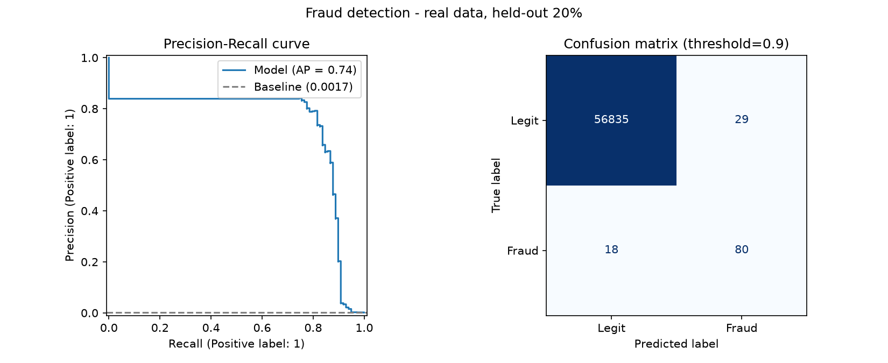

# Fraud Detection MLOps

[](https://github.com/lalith0087/fraud-detection-mlops/actions/workflows/ci.yml)

End-to-end fraud detection: data generation → training → REST API → Docker → CI.

## Overview
- **Data**: the real ULB credit-card fraud dataset (fetched from OpenML, cached in `data/`) or a synthetic generator (`src/data.py`).
- **Tracking**: every run logs params, metrics and artifacts to MLflow (SQLite backend).
- **Model**: `HistGradientBoostingClassifier` with balanced class weights, evaluated on PR-AUC (the right metric for imbalanced data).
- **Serving**: FastAPI `POST /predict` with validated input and a tunable threshold.
- **Ops**: Dockerfile trains the model at build time; GitHub Actions runs tests and builds the image.

## Results (held-out 20%)
| Data | PR-AUC | ROC-AUC | Precision | Recall | F1 |
|---|---|---|---|---|---|
| Real (ULB credit-card, 284,807 txns, 0.17% fraud) | 0.735 | 0.962 | 0.734 | 0.816 | 0.773 |
| Synthetic (1% fraud, overlapping classes) | 0.586 | 0.791 | 0.457 | 0.567 | 0.506 |



On the real data at the tuned threshold: 80 of 98 frauds caught, with 29 false alarms out of 56,864 legitimate transactions.

The decision threshold is tuned for F1 on a validation split (0.9 on the real data), not fixed at 0.5.

## Run it
```bash
python -m venv .venv && source .venv/bin/activate
pip install -r requirements.txt
python -m src.train --data real   # or --data synthetic (default)
python -m src.plot                 # regenerate docs/results.png
mlflow ui --backend-store-uri sqlite:///mlflow.db
uvicorn src.api:app --reload
pytest
```
```bash
curl localhost:8000/features   # feature names the loaded model expects
curl -X POST localhost:8000/predict -H 'content-type: application/json' \
  -d '{"features":{"amount":900,"hour":2,"merchant_risk":0.9,"distance_from_home":300,"txn_last_24h":8,"is_foreign":1}}'
```

## Next steps
Cost-based threshold tuning, drift monitoring, model registry.
